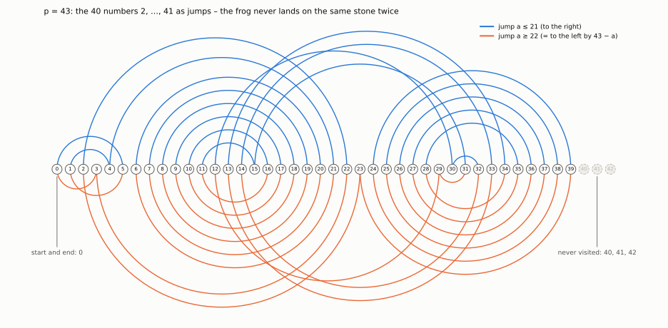

# Two examples that were not covered before

## p = 43: the numbers 2, 3, …, 41

**The task.** Arrange the 40 numbers 2, 3, …, 41 so that, adding them up modulo 43, the same value
never appears twice. This is Graham's conjecture for A = ℤ₄₃ ∖ {0, 1, −1}: |A| = 40 = p − 3, and the
sum of all the numbers is 0 (mod 43).

**Why this case was open.**

| known before | not sufficient because |
|---|---|
| \|A\| ≤ 22 for sum 0 (Costa, Della Fiore, Fontana, Vena 2026) | here \|A\| = 40 |
| all sets in ℤ_n up to n = 25 by computer (Archdeacon, Dinitz, Mattern, Stinson) | 43 > 25 |
| \|A\| = p − 3, but only for sum ≠ 0 (Hicks, Ollis, Schmitt 2019) | here the sum is 0 |
| all sufficiently large p (Pham, Sauermann et al. 2026) | no explicit bound; 43 is certainly too small |

To our knowledge, no published result covered the case "|A| = p − 3, sum 0" for the primes
29, 31, 37, 41, 43, … We use p = 43, the first prime beyond our own (unpublished) exhaustive computer
check of all subsets for n ≤ 41.

**The ordering given by the construction** (r = 20). In bold: the partial sums, all distinct.

| step i | 1 | 2 | 3 | 4 | 5 | 6 | 7 | 8 | 9 | 10 |
|---|---|---|---|---|---|---|---|---|---|---|
| number aᵢ | 5 | 39 | 3 | 17 | 28 | 14 | 30 | 12 | 32 | 10 |
| partial sum sᵢ | **5** | **1** | **4** | **21** | **6** | **20** | **7** | **19** | **8** | **18** |

| step i | 11 | 12 | 13 | 14 | 15 | 16 | 17 | 18 | 19 | 20 |
|---|---|---|---|---|---|---|---|---|---|---|
| number aᵢ | 34 | 8 | 36 | 6 | 38 | 4 | 16 | 41 | 26 | 18 |
| partial sum sᵢ | **9** | **17** | **10** | **16** | **11** | **15** | **31** | **29** | **12** | **30** |

| step i | 21 | 22 | 23 | 24 | 25 | 26 | 27 | 28 | 29 | 30 |
|---|---|---|---|---|---|---|---|---|---|---|
| number aᵢ | 2 | 25 | 19 | 23 | 21 | 37 | 7 | 35 | 9 | 33 |
| partial sum sᵢ | **32** | **14** | **33** | **13** | **34** | **28** | **35** | **27** | **36** | **26** |

| step i | 31 | 32 | 33 | 34 | 35 | 36 | 37 | 38 | 39 | 40 |
|---|---|---|---|---|---|---|---|---|---|---|
| number aᵢ | 11 | 31 | 13 | 29 | 15 | 27 | 22 | 20 | 24 | 40 |
| partial sum sᵢ | **37** | **25** | **38** | **24** | **39** | **23** | **2** | **22** | **3** | **0** |

The partial sums are exactly the numbers 0 to 39, each once; 40, 41 and 42 never occur.

*Picture.* A frog stands on stone 0 of the stones 0 … 42 (a circle, since 43 ≡ 0). It jumps by the
numbers aᵢ in turn; a number ≥ 22 is a jump to the left by 43 − aᵢ. It visits each of the stones 0 … 39
exactly once and finally returns to 0; it never reaches the stones 40, 41, 42.

**All 40-element sets with sum 0.** In ℤ₄₃ ∖ {0} these are exactly the 21 sets ℤ₄₃ ∖ {0, x, −x}. For
each of them, multiplying the table by x gives a valid ordering; for x = 2, for instance, it starts
10, 35, 6, 34, …

*To be honest:* for a single small p, a computer search would also have found an ordering within
seconds; the case was simply not covered by any published result. The second example shows the real
strength of the theorem.

## p = 2¹²⁷ − 1: a prime with 39 digits

p = 170141183460469231731687303715884105727 is a Mersenne prime. The set A = ℤ_p ∖ {0, 1, −1} has
p − 3 ≈ 1.7 · 10³⁸ elements.

- **Out of reach of computation:** no machine can store or check an ordering of this length.
- **Out of reach of the asymptotic theorems:** they hold only beyond an unspecified bound; according to
  the report in Quanta Magazine (Sept. 2026), roughly beyond 10¹⁰⁰. 2¹²⁷ − 1 ≈ 1.7 · 10³⁸ lies far
  below that.

The theorem nevertheless gives the ordering explicitly. With r = (p − 3)/2 =
85070591730234615865843651857942052862, and negative numbers as shorthand (−4 means p − 4):

  **5, −4, 3, r − 3, r + 8, r − 6, r + 10, r − 8, r + 12, r − 10, …, r − 5, r + 7, r + 2, r, r + 4, −3**

The partial sums start with 5, 1, 4, r + 1, 6, r, 7, r − 1, 8, r − 2, … — the frog swings between the
small stones and those around r. That it never lands on the same stone twice during all
1.7 · 10³⁸ jumps is guaranteed by the proof, which is machine-checked in Lean (`lean/`).

---
Data: `python/example.py`; figure: `python/figures.py`.
