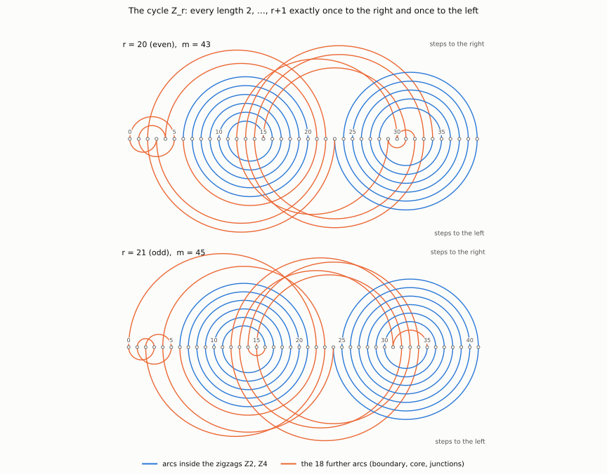

# Graham's rearrangement conjecture for A = ℤ_m ∖ {0, x, −x}

## Theorem

Let m ≥ 3 be odd and let x ∈ ℤ_m be coprime to m. Then the m − 3 elements of A = ℤ_m ∖ {0, x, −x}
can be ordered so that the partial sums a₁, a₁ + a₂, …, a₁ + ⋯ + a_{m−3} are pairwise distinct.

*Context.* For a prime p and |A| = p − 3, the set A = ℤ_p ∖ {0, x, −x} is exactly the case of sum
ΣA = 0. Hicks, Ollis and Schmitt [HOS] treat sets of size ≥ p − 3 with sum ≠ 0; Kravitz [K] lists the
sum-zero case as open. With the theorem, Graham's conjecture holds for all A ⊆ ℤ_p ∖ {0} with
|A| ≥ p − 3.

## 1. Two reductions

**Dilation.** Multiplication by x⁻¹ is an automorphism of ℤ_m. It maps A onto ℤ_m ∖ {0, ±1} and
preserves the property "partial sums pairwise distinct". It therefore suffices to consider

  A = {2, 3, …, m − 2}.

For m = 3 the set A is empty. The cases m = 5, …, 23 are settled by the table in Section 4. From now
on let m = 2r + 3 with r ≥ 11.

**Lemma 1 (lifting).** Let (z₀, z₁, …, z_{2r−1}) be a cyclic arrangement of the integers
0, 1, …, 2r − 1 such that among the 2r differences z_{i+1} − z_i (indices modulo 2r) each of the numbers
±2, ±3, …, ±(r+1) occurs exactly once. Then a_i := (z_i − z_{i−1}) mod m, i = 1, …, 2r, is an
ordering of A with pairwise distinct partial sums.

*Proof.*
- *Every element of A occurs exactly once.* A step +d with 2 ≤ d ≤ r + 1 gives d. A step −d gives
  m − d, which lies in [r + 2, 2r + 1] = [r + 2, m − 2]. Together this is {2, …, m − 2} = A.
- *The partial sums are distinct.* We have a₁ + ⋯ + a_j ≡ z_j − z₀ (mod m) for j = 1, …, 2r, with
  z_{2r} = z₀. The numbers z₁, …, z_{2r−1}, z₀ are distinct integers in [0, 2r − 1], and 2r − 1 < m,
  so their residues modulo m are distinct as well.

In particular the last partial sum is 0. ∎

*Intuition.* A frog jumps on the stones 0, 1, …, 2r − 1 of a row. It visits every stone exactly once
and returns to its start. Every jump length 2, …, r + 1 is used exactly once to the right and exactly
once to the left. Reading the stones modulo m, its sequence of jumps is the required ordering.

## 2. The cycle Z_r

The vertices are listed in cyclic order in five parts; after the last part the cycle returns to 0.

**r = 2h even (h ≥ 6):**

| part | vertices |
|---|---|
| Z1 | 0, 5, 1, 4, r+1 |
| Z2 | 6, r, 7, r−1, 8, r−2, …, h+1, h+5 (pairs 6+i, r−i for i = 0, …, h−5) |
| Z3 | 3h+1, 3h−1, h+2, 3h, 3h+2, h+4, 3h+3, h+3 |
| Z4 | 3h+4, 3h−2, 3h+5, 3h−3, …, 4h−2, 2h+4 (pairs 3h+4+i, 3h−2−i for i = 0, …, h−6), then 4h−1, r+3 |
| Z5 | 2, r+2, 3 |

**r = 2s+1 odd (s ≥ 5):**

| part | vertices |
|---|---|
| Z1 | 0, r+1 |
| Z2 | 6, r, 7, r−1, …, s+1, s+6 (pairs 6+i, r−i for i = 0, …, s−5) |
| Z3 | s+4, 3s+4, s+2, 3s+3, s+5, 3s+2, s+3, 3s+1 |
| Z4 | 3s+5, 3s, 3s+6, 3s−1, …, 4s+1, 2s+4 (pairs 3s+5+i, 3s−i for i = 0, …, s−4) |
| Z5 | 4, r+2, 2, 5, 1, 3 |

*Structure.* Z2 and Z4 are two zigzags, the blue spirals in the figure. Z2 swings between the two
ends of the interval [6, r], Z4 within the upper range [r+3, 2r−1]. In both, the jump length changes
by 1 from step to step and the sign alternates. The remaining 18 arcs (orange) connect the zigzags
with the boundary {0, …, 5, r+1, r+2} and with the core Z3.

## 3. Proof that Z_r satisfies the hypothesis of Lemma 1

**(a) Every vertex exactly once.**
- r even: Z1 ∪ Z5 = {0, …, 5, r+1, r+2}; Z2 = [6, h+1] ∪ [h+5, r]; Z3 = {h+2, h+3, h+4} ∪ [3h−1, 3h+3];
  Z4 = [2h+4, 3h−2] ∪ [3h+4, 4h−1] ∪ {r+3}. With r = 2h this is a partition of [0, 2r−1].
- r odd: Z1 ∪ Z5 = {0, …, 5, r+1, r+2}; Z2 = [6, s+1] ∪ [s+6, r]; Z3 = [s+2, s+5] ∪ [3s+1, 3s+4];
  Z4 = [r+3, 3s] ∪ [3s+5, 4s+1]. With r = 2s+1 this is a partition of [0, 2r−1].

**(b) The zigzags.** Read off from the pair formulas:

| | to the right (+) | to the left (−) |
|---|---|---|
| Z2, r even | 6+i → r−i: even lengths 4, 6, …, r−6 | r−i → 7+i: odd lengths 5, 7, …, r−7 |
| Z4, r even | 3h−2−i → 3h+5+i and 2h+4 → 4h−1: odd 7, 9, …, r−5 | 3h+4+i → 3h−2−i and 4h−1 → r+3: even 6, 8, …, r−4 |
| Z2, r odd | 6+i → r−i: odd 5, 7, …, r−6 | r−i → 7+i: even 6, 8, …, r−7 |
| Z4, r odd | 3s−i → 3s+6+i: even 6, 8, …, r−5 | 3s+5+i → 3s−i: odd 5, 7, …, r−4 |

In each row every length occurs at most once. Together, the two zigzags cover all lengths 6 to r − 6
in both directions, plus a few boundary values.

**(c) The remaining 18 arcs.** Each row belongs to one length. A dash means that this length already
occurs in this direction in a zigzag (part b).

| length | r even, right | r even, left | r odd, right | r odd, left |
|---|---|---|---|---|
| 2 | 3h → 3h+2 | 3h+1 → 3h−1 | 1 → 3 | s+6 → s+4 |
| 3 | 1 → 4 | 3 → 0 | 2 → 5 | 3 → 0 |
| 4 | – | 5 → 1 | 3s+1 → 3s+5 | 5 → 1 |
| 5 | 0 → 5 | – | – | – |
| r−5 | – | r+1 → 6 | – | r+1 → 6 |
| r−4 | h+5 → 3h+1 | – | s+5 → 3s+2 | – |
| r−3 | 4 → r+1 | 3h−1 → h+2 | s+3 → 3s+1 | 3s+3 → s+5 |
| r−2 | h+2 → 3h | 3h+2 → h+4 | 4 → r+2 | 3s+2 → s+3 |
| r−1 | h+4 → 3h+3 | r+2 → 3 | s+4 → 3s+4 | r+3 → 4 |
| r | 2 → r+2 | 3h+3 → h+3 | s+2 → 3s+3 | r+2 → 2 |
| r+1 | h+3 → 3h+4 | r+3 → 2 | 0 → r+1 | 3s+4 → s+2 |

Each column contains 9 arcs, 18 in total. Together with the arcs of the zigzags these are all 2r arcs
of Z_r:
- r even: Z2 has r − 9 arcs and Z4 has r − 9 arcs;
- r odd: Z2 has r − 10 arcs and Z4 has r − 8 arcs.

**(d) Balance.** The lengths 6, …, r − 6 are supplied in both directions by the zigzags (part b). In
each column, each of the lengths 2, 3, 4, 5 and r − 5, …, r + 1 is supplied exactly once: either by a
zigzag (dash) or by the arc in the table. Since r ≥ 11, these lengths are pairwise distinct and
separate from 6, …, r − 6. Hence every length 2, …, r + 1 occurs exactly once to the right and exactly
once to the left. With (a) and Lemma 1, the theorem follows for m = 2r + 3 ≥ 25. ∎

## 4. The cases m ≤ 23

For x = 1, i.e. A = {2, …, m − 2}, each of the following orderings has pairwise distinct partial sums;
this can be checked directly.

| m | ordering |
|---|---|
| 5 | 2, 3 |
| 7 | 2, 3, 5, 4 |
| 9 | 2, 3, 5, 7, 4, 6 |
| 11 | 2, 3, 4, 5, 9, 6, 8, 7 |
| 13 | 2, 3, 4, 5, 6, 9, 8, 10, 11, 7 |
| 15 | 2, 3, 4, 5, 7, 6, 10, 9, 12, 13, 8, 11 |
| 17 | 2, 3, 4, 5, 6, 7, 8, 10, 12, 9, 15, 11, 14, 13 |
| 19 | 2, 3, 4, 5, 6, 7, 8, 9, 11, 14, 10, 12, 17, 13, 16, 15 |
| 21 | 2, 3, 4, 5, 6, 7, 9, 10, 8, 12, 13, 16, 11, 18, 19, 17, 15, 14 |
| 23 | 2, 3, 4, 5, 6, 7, 8, 9, 10, 11, 14, 12, 16, 15, 19, 13, 20, 21, 18, 17 |

Together with the dilation of Section 1, this proves the theorem for all odd m ≥ 3. ∎

## 5. The prime-field form

**Corollary.** Let p be a prime and S ⊆ ℤ_p ∖ {0} with |S| = p − 3 and ΣS = 0. Then S has an ordering
with pairwise distinct partial sums.

*Proof.* For p ≤ 3, S = ∅. For p ≥ 5, the complement of S ∪ {0} consists of two elements y, z. The
sum of all elements of ℤ_p is 0 (p odd), so y + z = −ΣS = 0, i.e. z = −y with y ≠ 0. Hence
S = ℤ_p ∖ {0, y, −y}, and the theorem applies with m = p and x = y. ∎

## References

- [HOS] J. Hicks, M. A. Ollis, J. R. Schmitt, *Distinct partial sums in cyclic groups: polynomial method
  and constructive approaches*, J. Combin. Des. 27 (2019) 369–385, arXiv:1809.02684 (Theorem 4.6).
- [K] N. Kravitz, *Rearranging small sets for distinct partial sums*, Integers 24 (2024) A113,
  arXiv:2407.01835 (introduction).
- M. A. Ollis, *Sequenceable groups and related topics*, Electron. J. Combin. DS10, version 3 (2025),
  Theorem 39.

---
**Formal verification.** The complete proof (the theorem and the corollary) is formalized in Lean 4 with
Mathlib in `lean/`; see `README.md`. Computational cross-checks, which are not part of the proof:
`python/check_proof_tables.py` checks Section 3 literally for r = 11 … 2000, `python/small_cases.py`
produces and checks the table of Section 4, `python/construction.py` checks Z_r and the orderings in
ℤ_m.
